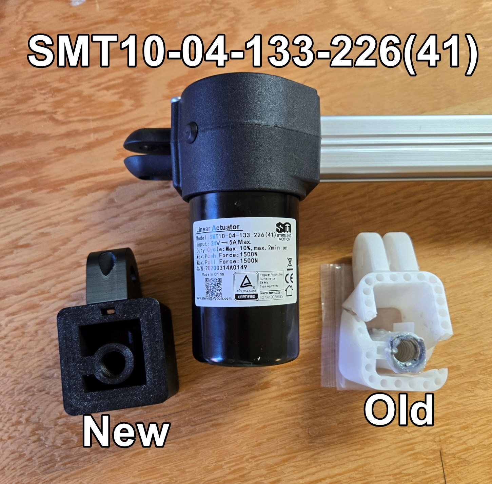

## About Me

During my time in university, I've come to learn that I love jumping in on something I believe has a chance to work. All it takes is a half-baked idea of a concept that doesn't need to exist, and suddenly 3 hours have passed and I'm 3D printing the 4th and final prototype of wheel fenders for an electric skateboard. Sure, I may have figured out the perfect shape to cover the wheel to prevent rain from splashing up, but that doesn't mean it didn't fall off and break 30 feet into test riding it.

To me it doesn't matter too much that an idea seems ridiculous. The idea of working on something that no one has put effort into before really pushes me to be the first, even if it means that the final product ends up as a story of something I tried once. Often that means I have to learn something new to give a full effort, whether it's new coding languages or a new piece of software I'm not familiar with. Honestly I think that's the reason that I gravitated to computers, due to the fact that there's really no limit to what you can try.

I know that success is never guaranteed, but I'd love to be the person who tried. Even if it does mean falling off a skateboard after accidentally running over a prototype water fender. I hope this site demonstrates a few of the ideas that I've had with enough success that I think they deserve some more public attention.

---

## Projects and Experiences

[My Work Experience](/work_experience)
  

---

[Electric Recliner Repair — Barlow Fabrication](/model_design)
  

---

[3D Printed Smart Flip Clock](/flip_clock)
  

---

[MIDI Stepper Motor Music](/midi_motor_music)
  
An open-source Arduino project that turns stepper motors into musical instruments using MIDI files.

---

[RapidFTA](/rapidfta)
  

 
A web application for quickly searching and exploring Free Trade Agreement data.
