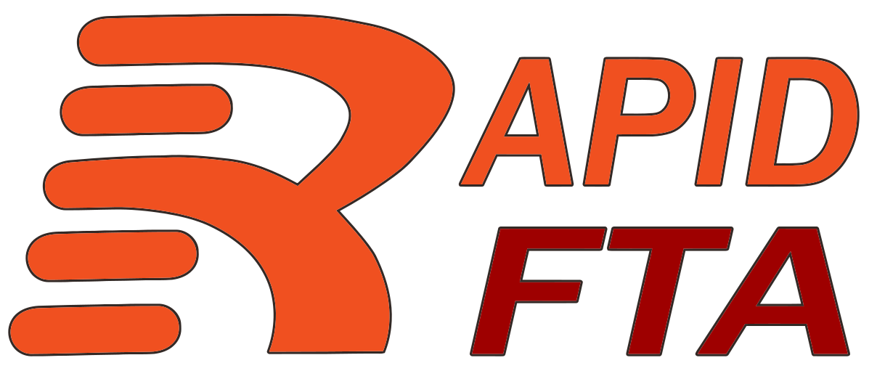

# RapidFTA

[RapidFTA](https://rapidfta.com) is an advanced searching tool for BidFTA auctions. It aggregates auctions across multiple locations and provides powerful filtering to help users quickly find what they're looking for.

Built with an Angular frontend, a Go backend, and deployed with Docker.

**Features**

- Infinite scrolling to quickly browse hundreds of auctions
- Quick-view auction photos
- Filters saved in the URL for easy bookmarking of saved searches
- Advanced filtering including:
  - Location-based search
  - Multi-tag text search across name and description, with matching keywords highlighted and pushed to the top
  - Text exclusion to hide uninteresting results
  - MSRP price range, maximum current bid, and minimum percent-off filters
  - **Average price tracking!** - This is the average sale price for the item across all auctions, This helps identify if a deal is really a deal or if the item is just overpriced across the board.
  - Time remaining filter for auctions ending soon
- Daily Digest email with new auction items for filters you set up, so you can stay on top of new items without having to check the site every day
- Auction ending email notifications for items you're interested in, so you can be ready to bid when the auction is about to end
- **Dark mode!**

**Visit the site:** [RapidFTA.com](https://rapidfta.com)
